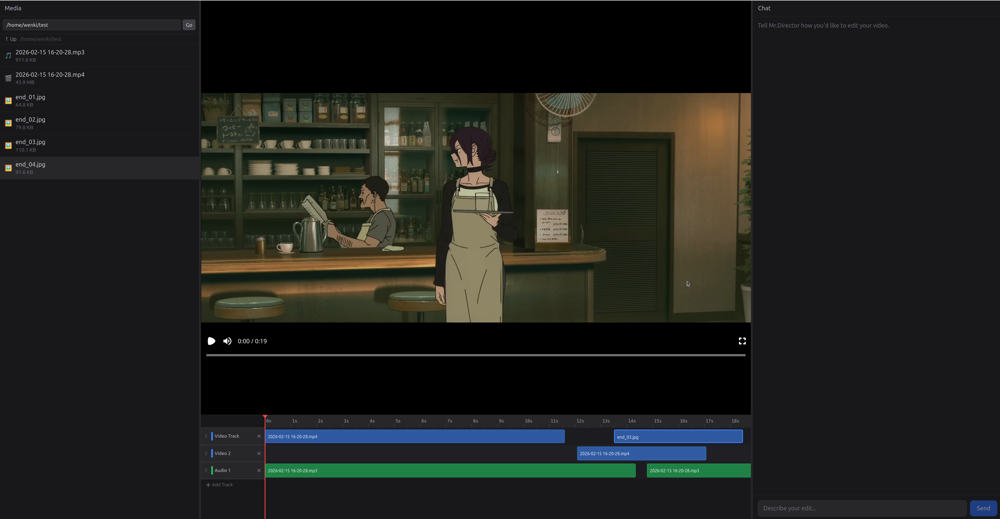

# Video Agent — LLM as Director

[English](README_en.md) | 中文

作为一个懒狗，我总是想尽办法偷懒。
现在代码都是vibecoding了，你还指望我自己手动剪辑吗？
这就是本项目的由来，一个像claudecode/codex那样的剪辑agent

傻瓜式操作：丢进去一个录屏，说一句"剪成30秒抖音"，剩下的事不用管。

```
>>> 把桌面上那个录屏剪成30秒抖音视频，以最终效果作为开头
```

## 它怎么工作的

不是那种"选片段→填参数→点导出"的固定流水线。
更像是雇了个编导——你说意图，它自己决定怎么干。

Agent 会用 Gemini 看懂视频画面，再用本地 Whisper 把语音一句一句精确转录出来（帧级时间戳，精度 ~100ms），最后给你出一份编导方案，等你点头之后才开始动刀。

改了主意也没关系，直接说，它会重新出方案再确认，不会偷偷就改了。

## nemovideo&chatcut：你好

可能有人会问，既然同类已经做的这么好了，你再做这个有什么用

我的回答是：本地优先，隐私优先，上限极高

不想要上传外部文件？项目天生就是本地文件访问优先设计

不想上传大模型？你可以使用本地模型，只不过可能得改造下代码

最重要的是他是开源的，你想怎么配置怎么配置

你甚至可以在系统提示词给出一个剪辑风格/剪辑模板，或者在每一次对话中让llm总结出你的剪辑风格（好主意，我要写入TODO）

我还给他配备了shell,第一次使用的时候我忘记给出工作路径，他能自己找到我描述的文件

## quicklook

 

## 跑起来

### 环境要求

- Node.js 18+
- Python 3.11+
- pnpm
- FFmpeg / ffprobe
- Gemini API Key（[Google AI Studio](https://aistudio.google.com/) 获取）

### 安装

```bash
# 1. 安装前端依赖
pnpm install

# 2. 安装后端 Python 依赖
cd apps/backend
pip install -e .
```

### 配置

复制 `apps/backend/.env.example` 为 `apps/backend/.env`，填入你的 Gemini API Key：

```bash
MRDV2_GEMINI_API_KEY=your-key-here
```

其他可选配置：

| 变量 | 默认值 | 说明 |
|------|--------|------|
| `MRDV2_GEMINI_BASE_URL` | `""` | 自定义 API 端点（代理/中转） |
| `MRDV2_GEMINI_MODEL` | `gemini-2.5-flash` | 模型名称(我用3.1的，也只测过3.1,有问题issue见) |
| `MRDV2_WHISPER_MODEL_SIZE` | `medium` | Whisper 模型大小（tiny/small/base/medium/large） |
| `MRDV2_WHISPER_DEVICE` | `auto` | 计算设备（auto/cuda/cpu） |

### 启动

```bash
# 前后端一起跑
pnpm dev

# 或者分开跑
pnpm dev:frontend   # http://localhost:5173
pnpm dev:backend    # http://localhost:8000
```

打开浏览器访问 `http://localhost:5173`，创建项目，开始对话。

## 能干什么

**视频理解** — Gemini 多模态分析视频画面，识别场景、节奏、画面风格、文字内容，给出剪辑建议

**语音转录** — 本地 Whisper 逐字转录，词级时间戳精度 ~100ms，自动语言检测

**智能剪辑** — 基于理解结果自动生成剪辑方案：切分、拼接、变速、排列，一句话搞定

**字幕生成** — 转录结果一键生成字幕轨道，自动对齐时间轴

**实时预览** — Remotion 浏览器内渲染，改了就能看，不用等导出

**方案确认** — Agent 先出方案让你过目，点头了才动刀，改主意随时说

**Shell 访问** — 内置沙盒化 shell（ffprobe、mediainfo 等），Agent 能自己探索媒体文件信息

**本地文件访问** — 直接读取本地文件系统，不需要上传

## 未来计划

当前的项目并没有想象的好用，但是整个项目的核心是基于gemini的多模态特性，相信在llm迭代变强的过程中，遇到的问题会被更强的模型自然而然的解决

## 待实现


（已实现）一个比在黑色命令行里敲字要好一点的ui

webgpu+WGSL：调色

特效

剪辑风格个性化

当前timeline采用自定义json,添加json转为otio或FCPXML7

SPEC.md 也记录了一些，不想再重复写了

## 这里记录一次重大决策变更

之前一直采用ffmpeg假装自己可以timeline-free

在深入后才发现，timeline和诸如ACES才是剪辑得以存在的道理，timeline-free简直是倒反天罡

所以在调研chatcut和nemovideo，以及开源的一些剪辑工具后，最后决定使用remotion+webgpu来做前端的timeline展示