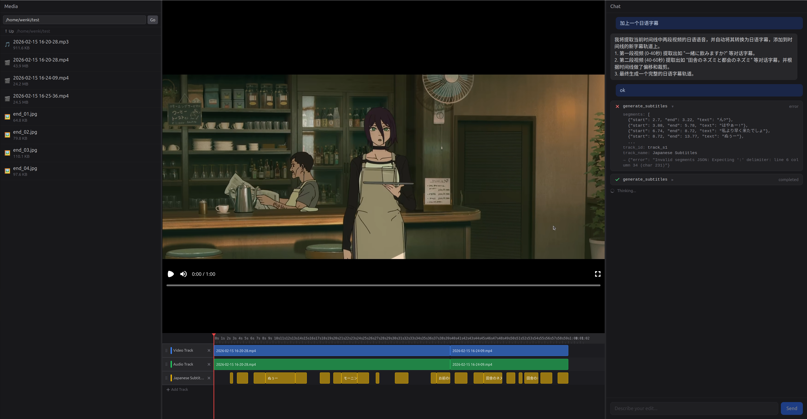
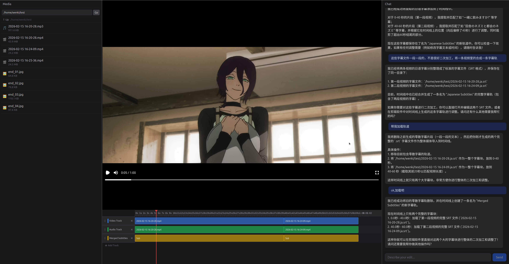

# Mr.Director V2 — AI Native Video Editor

English | [中文](README.md)

As a lazy developer, I'm always looking for shortcuts.
Now that coding is all about vibecoding, do you really expect me to manually edit videos?
That's why this project exists — a video editing agent like Claude Code / Codex.

Dead simple: drop in a screen recording, say "cut it into a 30-second TikTok," and walk away.

```
>>> Cut that screen recording on the desktop into a 30-second TikTok, use the best part as the opening
```

## How It Works

Not a fixed pipeline of "select clips → fill parameters → click export."
More like hiring a director — you state your intent, and it figures out the rest.

The Agent uses Gemini (or any OpenAI-compatible model) to understand video content, then runs local Whisper to transcribe speech word-by-word with ~100ms timestamp precision. Finally, it presents an editing plan for your approval before making any cuts.

Changed your mind? Just say so — it'll revise the plan and confirm again. It won't make changes behind your back.

## Core Features

### 🎬 Multimodal Video Understanding
Gemini multimodal analysis of video content: scene detection, pacing, visual style, text recognition, and intelligent editing suggestions.

### 🎤 Local Speech Transcription
Whisper runs locally for word-level transcription with ~100ms timestamp precision and automatic language detection. No audio uploads to the cloud.

### 🤖 ReAct Agent Architecture
Not a rigid workflow, but an autonomous decision-making Agent. Like Claude Code: you say "fix this bug," and it decides which files to read, which lines to change, and which tests to run. When the Agent receives materials + intent, it autonomously decides whether to analyze visuals first or transcribe audio first.

### 📝 Timeline JSON Core
A platform-agnostic editing plan description format that can be re-edited in any compatible software:
- Multi-track timeline (video/audio/subtitle)
- Cut, join, speed ramping
- Picture-in-picture, crop, opacity
- Subtitle style customization

### 🚀 Real-time Preview & Export
- **Remotion Browser Rendering**: See changes instantly without exporting
- **Remotion SSR Export**: MP4 video export
- **Professional Format Export**: OTIO / FCPXML7 for seamless integration with DaVinci Resolve, Final Cut Pro

### 🛠️ Powerful Tool Set
- **Shell Access**: Agent can run ffprobe, mediainfo to explore media on its own
- **Local File Access**: Direct filesystem access, no uploads needed
- **Time Mapping**: Automatic Source Time ↔ Timeline Time conversion
- **Batch Operations**: Clip CRUD supports batch transactions with automatic rollback on errors

## Why Another Video Editor?

You might ask: with tools like NemoVideo and ChatCut already out there, why build another one?

My answer: **local-first, privacy-first, sky-high ceiling, open-source and controllable**

- Don't want to upload files to external services? This project is designed for local file access from the ground up
- Don't want to rely on cloud LLMs? Supports Gemini and any OpenAI-compatible API (DeepSeek, Qwen, OpenRouter, etc.)
- Most importantly, it's open source — configure it however you want
- You can preset editing styles/templates in the system prompt, or let the LLM learn your editing preferences from conversations

## UI Preview





## Getting Started

### Prerequisites

- Node.js 18+
- Python 3.11+
- pnpm
- FFmpeg / ffprobe
- API Key ([Google AI Studio](https://aistudio.google.com/) or any OpenAI-compatible service)

### Installation

```bash
# 1. Install frontend dependencies
pnpm install

# 2. Install backend Python dependencies
cd apps/backend
pip install -e .
```

### Configuration

Copy `apps/backend/.env.example` to `apps/backend/.env`:

**Using Gemini (default):**
```bash
MRDV2_GEMINI_API_KEY=your-key-here
MRDV2_GEMINI_MODEL=gemini-2.5-flash
```

**Using OpenAI-compatible API (DeepSeek / Qwen / OpenRouter, etc.):**
```bash
MRDV2_LLM_PROVIDER=openai
MRDV2_OPENAI_API_KEY=sk-xxx
MRDV2_OPENAI_MODEL=gpt-4o
# Optional: custom base_url
MRDV2_OPENAI_BASE_URL=https://api.deepseek.com/v1
# Optional: enable thinking mode (dashscope / deepseek / off)
MRDV2_OPENAI_THINKING=deepseek
```

**Other optional configurations:**

| Variable | Default | Description |
|----------|---------|-------------|
| `MRDV2_GEMINI_BASE_URL` | `""` | Gemini custom API endpoint (proxy/relay) |
| `MRDV2_WHISPER_MODEL_SIZE` | `medium` | Whisper model size (tiny/small/base/medium/large) |
| `MRDV2_WHISPER_DEVICE` | `auto` | Compute device (auto/cuda/cpu) |
| `MRDV2_PROJECTS_DIR` | `./projects` | Project files storage path |
| `MRDV2_EXPORTS_DIR` | `./projects/exports` | Export files path |
| `MRDV2_EXPORT_GL` | `auto` | Video rendering GL backend (auto/angle-egl/swangle/egl/vulkan) |

### Run

```bash
# Start both frontend and backend
pnpm dev

# Or run them separately
pnpm dev:frontend   # http://localhost:5173
pnpm dev:backend    # http://localhost:8000
```

Open `http://localhost:5173` in your browser, create a project, and start chatting.

## Usage Examples

### Basic Editing
```
Cut the screen recording on the desktop into a 30-second TikTok video, use the best part as the opening
```

### Smart Subtitles
```
Add subtitles to this video, style them like those big TikTok captions
```

### Speech Cleanup
```
Help me cut out the pauses, repetitions, and filler words from this video
```

### Picture-in-Picture
```
Make the small window in the top right bigger and move it to the bottom left
```

### Timeline Fine-tuning
Directly drag clips in the timeline editor, adjust in/out points, split segments — all changes sync to the preview in real-time.

## Technical Architecture

```
User Input
    ↓
ReAct Agent (Gemini/OpenAI)
    ↓
Tool Calls: analyze_video | transcribe_audio | edit_clips | split_timeline
    ↓
Timeline JSON (platform-agnostic editing plan)
    ↓
WebSocket Real-time Push
    ↓
Remotion Browser Rendering Preview
    ↓
Export: Remotion SSR → MP4 / OTIO / FCPXML7
```

## Implemented Features

- ✅ 3-Column UI (Media Browser | Video Preview + Multi-track Timeline | Chat Panel)
- ✅ Timeline Visual Editing (drag, split, delete, move)
- ✅ Real-time Agent Progress Display (thinking process, tool call status)
- ✅ Support for interrupting Agent operations
- ✅ Timeline JSON ↔ OTIO / FCPXML7 Export
- ✅ Remotion SSR Video Export
- ✅ Multi-LLM Backend Support (Gemini / OpenAI-compatible)
- ✅ Undo/Redo

## TODO

- 🚧 WebGPU + WGSL: Color Grading (RGB curves, HSL secondary grading)
- 🚧 Effects System
- 🚧 Personalized Editing Style Learning
- 🚧 Artlist API Smart Music Matching
- 🚧 Keyframe Animation
- 🚧 Transition Effects

## Architecture Decisions

### Why Timeline JSON instead of using OTIO directly?

OTIO is powerful but has almost zero support for subtitles (they get lost when exporting to DaVinci Resolve and Kdenlive). We need a more flexible internal format, converting to industry standards only at export time.

### Why Remotion?

After researching ChatCut, NemoVideo, and various open-source editing tools, we found browser-based rendering provides the closest "change it and see it" experience. Remotion lets us describe videos with React while supporting both browser preview and SSR export.

### Why not FFmpeg directly?

We initially tried using FFmpeg filter chains directly, but quickly realized that editing without a Timeline abstraction and color management (ACES) is fighting against the grain. The Timeline is the fundamental concept that makes editing possible.

## License

MIT License — use freely, contributions welcome!
